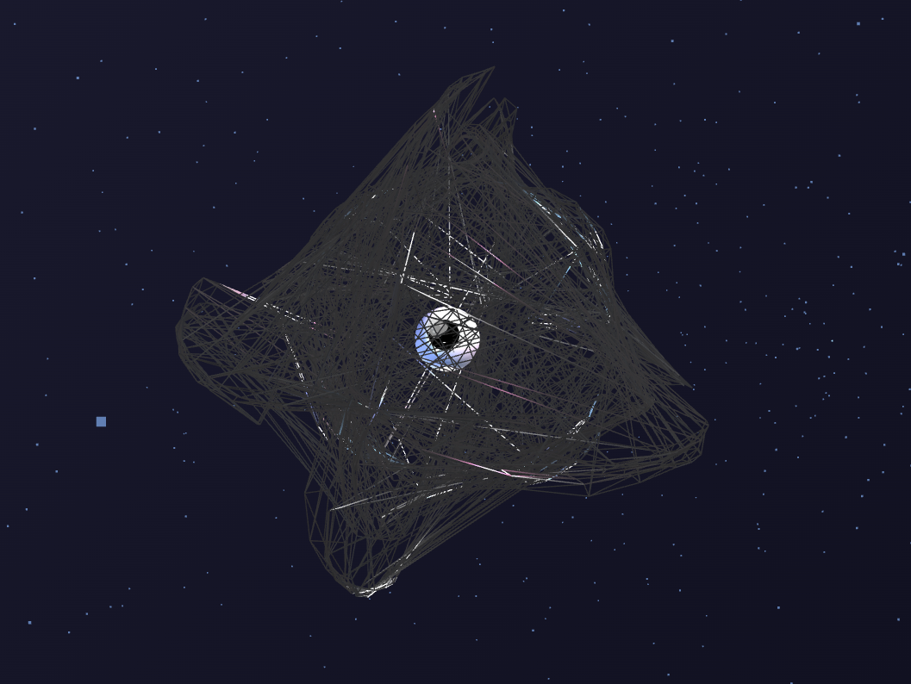
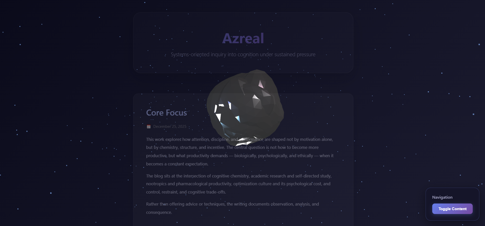

# Azreal: Interactive 3D Blog

A sophisticated, code-intensive exploration of cognition under sustained pressure. This project combines advanced 3D rendering with rigorous academic inquiry into attention, chemistry, and performance optimization.

## Overview
 
**Azreal** is an interactive web experience examining how attention, discipline, and performance are shaped by chemistry, structure, and incentive—not motivation alone. The blog documents observation, analysis, and consequence through scientific rigor while questioning optimization culture's psychological costs.

The interface demonstrates advanced WebGL capabilities through scroll-driven geometry morphing, adaptive rendering optimization, and real-time shader-based deformation.

## Technical Architecture

### Core Technologies
- **Three.js r128** — 3D rendering engine with WebGL backend
- **UnrealBloomPass** — Post-processing for cinematic liquid-like aesthetics
- **GLSL Shaders** — Custom vertex/fragment shaders for morphing geometry
- **Device-Aware LOD** — Adaptive geometry detail based on hardware capability

### Key Features

#### 1. **Scroll-Driven Shape Morphing**
The central visual metaphor transforms through four distinct phases:
- **0-25% scroll**: Organic blob (sphere with chaos deformation)
- **25-50% scroll**: Perfect circle (2D projection with flattening)
- **50-75% scroll**: Geometric cube (Manhattan geometry)
- **75-100% scroll**: Ophanim (celestial wheels—3 perpendicular rotating rings)

Each morphing stage uses **smoothstep easing** for natural transitions with pre-calculated shape targets to minimize per-frame computation.

#### 2. **Ophanim Animation System**
The final shape features three interlocking wireframe rings rotating at independent speeds:
- **Ring 1 (XY plane)**: 2.2 radius, Z-axis rotation at 2.0 rad/sec
- **Ring 2 (XZ plane)**: 2.8 radius, Y-axis rotation at 1.5 rad/sec  
- **Ring 3 (YZ plane)**: 3.4 radius, X-axis rotation at 1.0 rad/sec

Rotation is applied per-vertex in real-time using rotation matrices, creating the "wheels within wheels" effect referenced in classical mystical literature.

#### 3. **Realistic Eye Tracking**
A procedurally-generated eye with:
- Sclera (white eye sphere with specular highlights)
- Iris (black disc with radial detail lines)
- Pupil (dark sphere tracking cursor position with normalized vector constraints)
- Corneal shine (reflective specular highlight)
- Cursor-relative tracking with clamped offset (0.09 max to keep pupil within iris)

The pupil follows cursor position with 0.35 lerp factor for responsive, accurate tracking without "escaping" the iris boundary.

#### 4. **Adaptive Geometry LOD (Level of Detail)**
Device capability detection:
```javascript
Detail 3: ~2.5k vertices/petal  (mobile/low-end)
Detail 4: ~10k vertices/petal   (mid-range)
Detail 5: ~40k vertices/petal   (desktop)
```

Detection factors: User agent, `navigator.hardwareConcurrency`, `navigator.deviceMemory`

#### 5. **Chaos Deformation System**
Multi-layered procedural noise applied to vertex positions:
- 5 independent frequency layers (sinusoidal combinations)
- Time-based animation with per-petal offsets
- Gravity toward shape targets (not toward origin)
- Mouse proximity influence (0.5 radius effect)
- Dampening simulation (0.92 velocity factor) for organic motion

Intensity: Always active at 2.5x baseline.

#### 6. **Liquid Mercury Material**
- Color: 0xc0c0c0 (silver)
- Metalness: 0.95 (highly reflective)
- Roughness: 0.15 (smooth, polished surface)
- Environment map intensity: 2.5x
- Emissive: 0x808080 at 0.3 intensity

Creates liquid-like, reflective appearance that responds to scene lighting.

#### 7. **Smooth Scroll Integration**
- Raw scroll captured on `scroll` event
- Smooth interpolation with 0.12 lerp factor for 60fps fluidity
- Scroll progress normalized (0-1) across page height
- Content fade-in over first 80px of scroll
- Camera parallax zoom driven by scroll position

### Performance Optimizations

1. **Pre-calculated Shape Targets**: All 4 morphing targets computed once at geometry creation
2. **Per-vertex Velocity Tracking**: Momentum/dampening applied independently to each vertex
3. **Conditional Geometry Updates**: `needsUpdate` flags only set when vertices change
4. **Vertex Normal Recalculation**: Only computed when position updates occur
5. **Wireframe Toggle**: Only during ophanim phase (75-100% scroll)
6. **Browser Bloom Pass**: Composited post-processing for blur without per-pixel overhead

## Content Structure

### Core Articles
1. **Core Focus** — The central thesis and interdisciplinary approach
2. **Chemistry, Cognition & Study** — Neurochemistry and evidence-based inquiry
3. **Nootropics & Performance Inquiry** — Critical examination of pharmacological enhancement
4. **Method & Restraint** — Methodology, limitations, and epistemological caution
5. **Broader Themes** — Productivity culture, control, autonomy, optimization costs

### Tone & Approach
- Rigorous over sensational
- Nuanced over prescriptive
- Analytical over evangelical
- Documentation over advice

## Usage

### Local Development
1. Clone the repository
2. Open `Blog.html` in a modern browser (Chrome, Firefox, Safari, Edge)
3. No build process required — vanilla JavaScript + CDN libraries

### Browser Requirements
- WebGL support (all modern browsers)
- ES6+ JavaScript support
- At least 512MB RAM (recommended 1GB+)

### Controls
- **Scroll** — Drive morphing progression and content reveal
- **Mouse movement** — Rotate the mesh and control eye pupil tracking
- **Toggle Content button** — Hide/show text to focus on animation background

## File Structure
```
.
├── Blog.html          # Single-file application (1000+ lines)
├── README.md          # This file
└── index.html         # Alias/redirect (optional)
```

## Code Quality & Patterns

### Modular Functions
- `detectDeviceCapability()` — Hardware detection logic
- `calculateOphanimShape()` — Static ring geometry generation
- `calculateOphanimShapeWithRotation()` — Time-based ring rotation
- `createOphanimEye()` — Procedural eye generation
- `animate()` — Main render loop (60 FPS target)

### Data Organization
- `geometry.userData` — Stores shape targets, velocities, time offsets
- `petal.userData` — Position, rotation, deformation state
- `particles.userData` — Velocity vectors for each particle
- `camera.position` — Parallax-driven by scroll progress

### Rendering Pipeline
1. Scene setup (camera, renderer, lights)
2. Geometry creation with LOD adaptation
3. Material assignment (mercury-based PBR)
4. Lighting setup (ambient + 5 directional/point lights)
5. Bloom post-processing composition
6. RAF animation loop with scroll integration

## Performance Metrics

**Target**: 60 FPS on desktop, 30-45 FPS on mobile

**Optimization Results**:
- Desktop (Detail 5): ~40k vertices × 4 petals = 160k total vertices
- Mobile (Detail 3): ~2.5k vertices × 4 petals = 10k total vertices
- Post-processing: Single UnrealBloomPass (GPU-accelerated)
- Deformation: O(n) per-vertex updates with adaptive dampening

## Academic & Philosophical Grounding

This work is not:
- A self-help blog
- A productivity guide
- Medical advice
- An endorsement of enhancement

This work is:
- Documentation of long-form inquiry
- Analysis of cognition under constraint
- Preservation of nuance in polarized discussion
- Examination of the fine print in productivity's contract

## License

## Author

**Azreal** — Researcher and writer examining cognition, chemistry, and control.

---

**"If productivity is a contract, chemistry is one of its clauses. Most people sign without reading it. This work exists to examine the fine print."**
